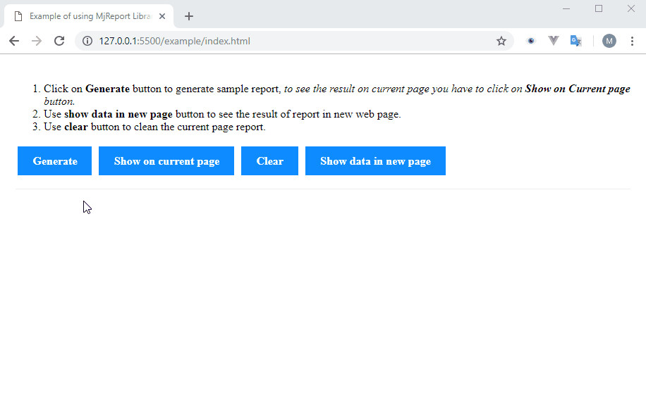

# MjReport
[](https://nodei.co/npm/mjreport/)  

My simple JavaScript report library to make report with html document elements for Electron and browser with no dependency and written in Typescript ;-)

## Example
[Demo](http://newvertex.github.io/MjReport/example/index.html)

Demo of generating and render report in browser:



[click here to see Electron.js demo gif](./example/mjreport02.gif)

source of demo available on [example](./example) directory of current repo.
#### [API Docs ](http://newvertex.github.io/MjReport/docs)
## Installation
for use in browser just add [UMD](https://unpkg.com/mjreport/dist/umd/index.min.js) version of package to your page:
```html
<script src="https://unpkg.com/mjreport/dist/umd/index.min.js"></script>
```
with npm:
```bash
$ npm install --save mjreport  

```
or with yarn:  
```bash
$ yarn add mjreport
```  

## Usage

1. To get started, you must first import library to your project, on browser you can use **umd** version, on the electron you can use commonjs to import module to your project.
2. On the **server** or on the **main process** of electron you have to create a **Generator** object in which to describe the report.
*(set styles/fonts, set header/footer elements, add text to report body, add table...)*
3. After describe your report you can generate report data and pass it to **client html page** or **electron renderer process**.
      - To pass data from page to page or from main process to renderer you can use [json-fn](https://www.npmjs.com/package/json-fn) to stringify & parse function or use global variable.
4. No on the other side you have to just create an instance of **Renderer** class of mjreport.
      1. You have to pass data came from Generator object as first argument.
      2. You can specify a *div with it's element id* to draw everything inside it or create a div with **mjRoot** id.
5. After create a new renderer you can call **draw()** method to show the report.

## Methods
To see full detailed check [API Docs](http://newvertex.github.io/MjReport/docs)
#### Generator
- Generator(title?: string, paperType?: PaperType): Generator
  - addCss(link: string): void
  - setStyle(rawCss: string): void
  - setHeader(elements: MjElement[]): void
  - setFooter(elements: MjElement[]): void
  - setContent(elements: MjElement[]): void
  - addText(text: string, className?: string, idName?: string): MjElement
  - addHeading(text: string, level?: HeadingLevel, className?: string, idName?: string): MjElement
  - addTable(value: TableValue, className?: string, idName?: string): MjElement
  - addPageBreak(): MjElement
  - generate(): Data

#### Renderer
- Renderer(data: Data, rootElementName?: string): Renderer
  - draw(): void

#### Enums:
- PaperType
  - A4_Portrait
  - A4_Landscape
  - A5_Portrait
  - A5_Landscape
- HeadingLevel
  - H1
  - H2
  - H3
  - H4
  - H5
  - H6
